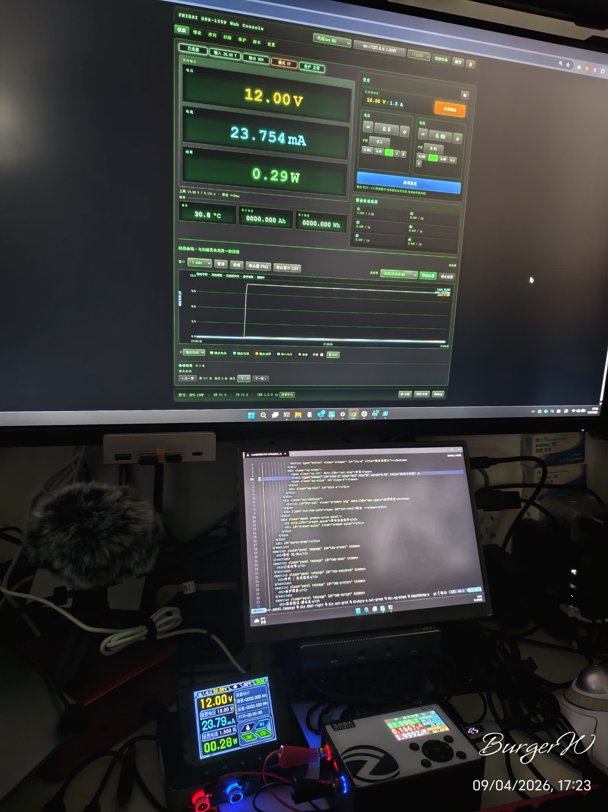
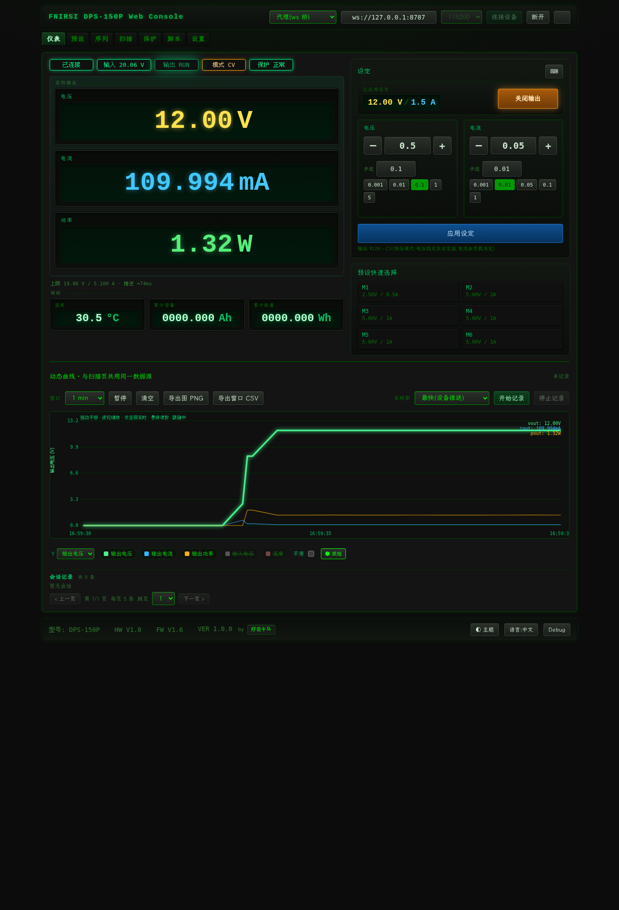
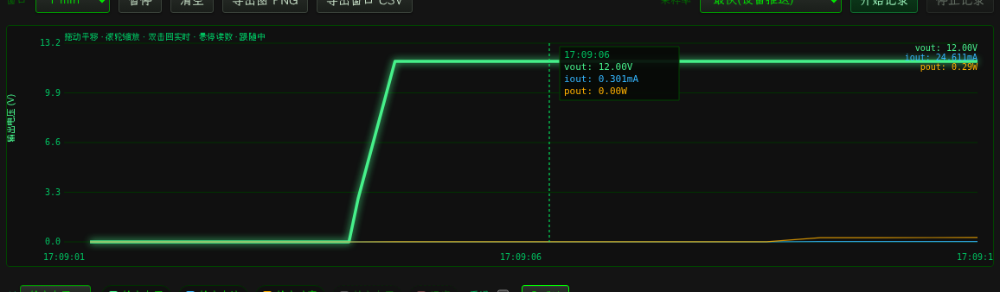
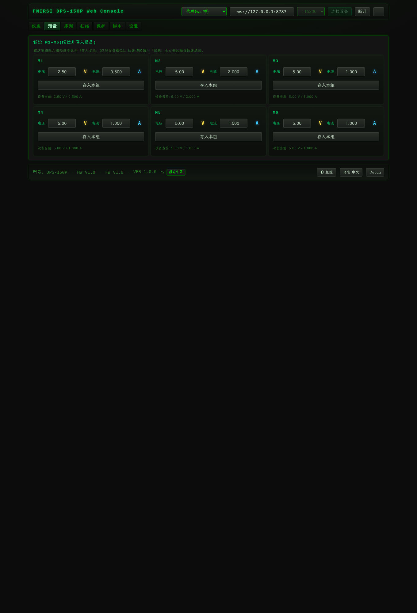
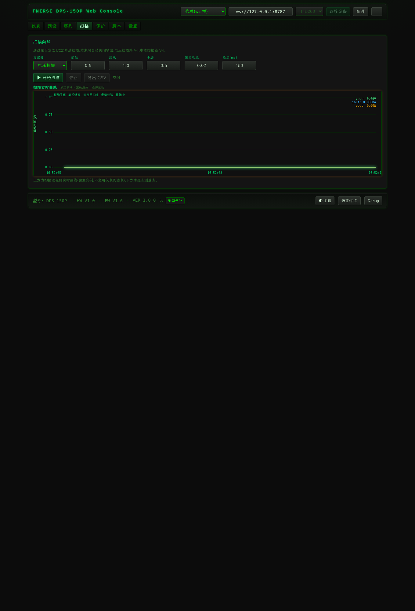
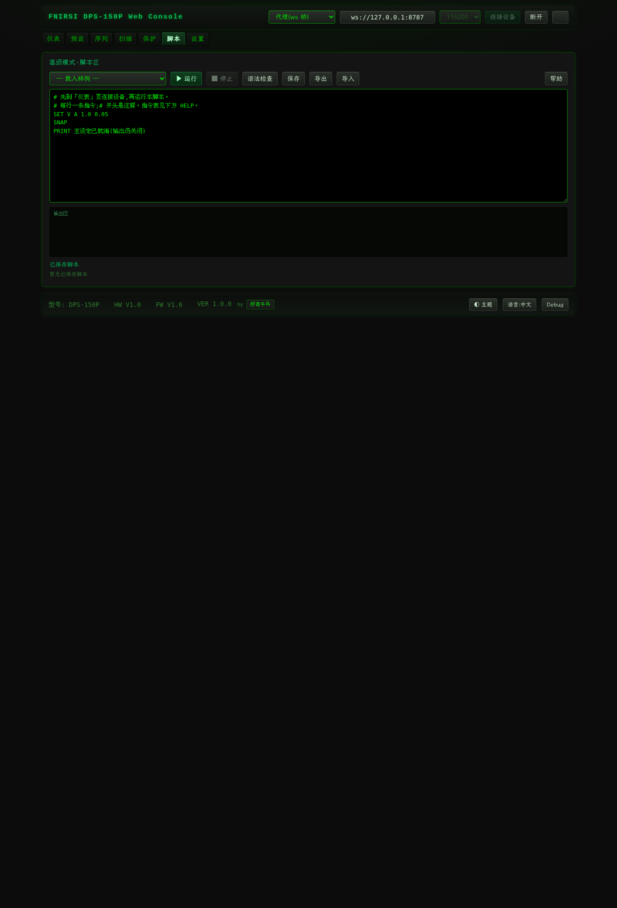
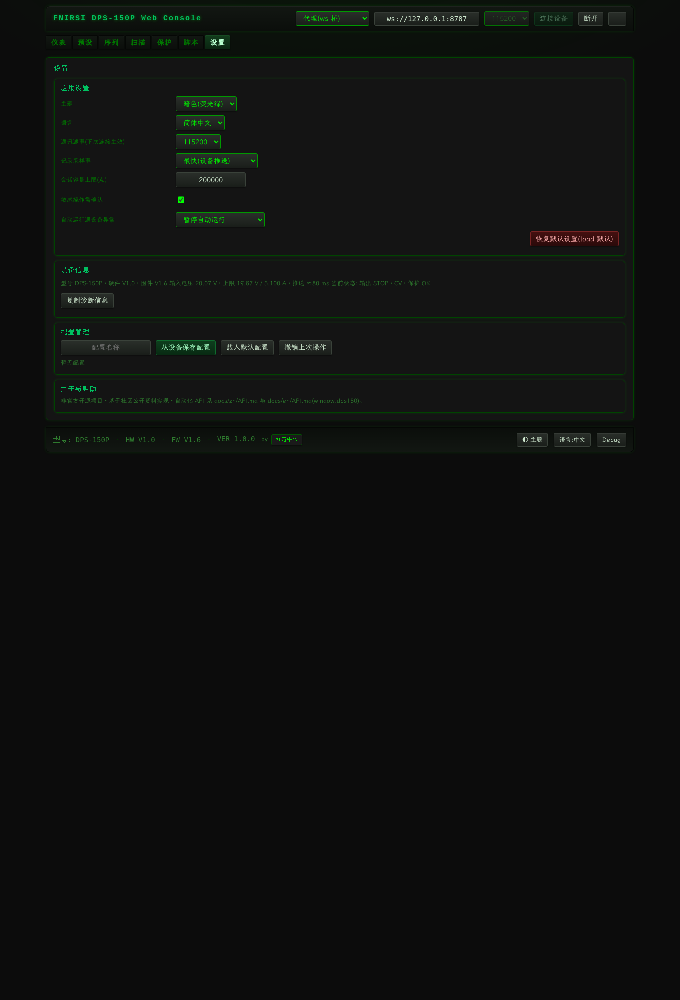

# FNIRSI DPS-150 Web Console

A pure-frontend web console for the **FNIRSI DPS-150 / DPS-150P** programmable DC power supply. Built for Chromium-based browsers that support [Web Serial](https://developer.chrome.com/articles/serial/) — no backend, no native install. Open the page and drive the device from a browser.

> **非官方 / Non-official project.** FNIRSI is a registered trademark of Shenzhen FNIRSI Technology Co., Ltd. This project is an independent, community-built tool based on publicly available community information. It is not affiliated with or endorsed by the manufacturer, and accuracy/reliability is not guaranteed. **Use at your own risk.**
>
> 🇨🇳 中文版: [docs/zh/README.md](docs/zh/README.md) · 📖 Automation API: [docs/en/API.md](docs/en/API.md) / [docs/zh/API.md](docs/zh/API.md)

## Screenshots

<details>
<summary>Click to view screenshots</summary>

**Hardware setup** (DPS-150P + PC, connected via USB):



**Live dashboard** (real device, 12 V / 0.11 A under a load):



**Live chart** (voltage step when a load engages):



**Presets**, **Scan**, **DSL script**, **Settings**:






</details>

## Highlights

- **Live instrument dashboards** — real-time voltage / current / power / temperature, status lamps (output, CV/CC mode, protection), set-point entry with upper-limit clamping, output on/off with confirmation.
- **Long-run recording** — curves with adjustable display window (pan/zoom), IndexedDB-backed sessions (seconds up to a week, adaptive sampling), CSV export.
- **Presets & protection** — edit/save M1–M6 presets and apply to the main setpoint; configure OVP/OCP/OPP/OTP/LVP thresholds.
- **Scan** — voltage / current sweep wizard (step + fixed axis), pre-run confirmation, V-I characteristic plot, results table & CSV export.
- **Sequencer** — table of (V, A, delay) steps, manual/auto execution (loop, start/end index), pre-run confirmation, safe interruption, auto output-off on completion.
- **DSL script area** — edit / syntax-check / run / stop with samples, save, import/export, full async control API.
- **Settings** — theme (dark/light), baud rate, sampling rate, session capacity, confirmation strength, auto-run interruption policy; recipe management.
- **Automation API** — `window.dps150` in the browser console (connect, set, output, presets, protection, brightness/volume, metering, snapshot, events).
- **i18n** — Simplified Chinese and English.

## Quick start

```bash
npm install
npm run dev        # dev server (Chrome/Edge, needs localhost/https)
npm test           # unit tests
npm run build      # production build in dist/
```

Open the printed URL, choose **USB (Web Serial)** (or a serial bridge) on the top bar, and connect. Always test in an unloaded / low-voltage / low-current state first.

## One-command management (Makefile)

Dependencies: node/npm, python3 (+pyserial), Playwright Chromium for automated tests. `make doctor` checks and tells you what is missing — including the Linux **cdc_acm** kernel driver and `/dev/ttyACM0` permissions. Any target that needs node modules installs them automatically on first use (or whenever `package.json`/`package-lock.json` changed), so a manual `npm install` before `make build/dev/up/…` is optional.

| Command | Purpose |
|---|---|
| `make up` | Start web server (4173) + serial bridge (8787), print the address (idempotent) |
| `make down` | Stop both |
| `make status` / `make logs` | Service status / view logs |
| `make dev` | Frontend dev server (vite dev, foreground) |
| `make build` / `make typecheck` / `make test` | Build / typecheck / unit tests |
| `make smoke` | Headless smoke (auto-starts the web preview) |
| `make ui-full-proxy` | Full device UI automation (via proxy, headless) |
| `node e2e/edge.cjs` (needs proxy) | Edge suite: invalid input not written / auto-task mutual exclusion / busy disables manual / tooltip / language switch |
| `make device-full` | Device-layer full verification (incl. 1V/50mA no-load RUN) |
| `make perm` | Give your user access to the device node now (session-only, auto sudo) |
| `make udev` | Install a udev rule for permanent device access (sudo; see “Linux device access” below) |
| `make clean` / `make distclean` | Clean build output / also remove node_modules |

Override with `make up PORT=8080 BAUD=9600`; bridge port with `WSPORT=…`.

## Architecture & robustness

- **Activity state machine** — `idle / connecting / auto` mutual exclusion for connection and auto tasks (sequence/scan/script); forbids concurrent tasks and manual writes during a run; stop uses request-confirm to avoid deadlock; disconnect stops tasks first. Unit-tested.
- **Defensive validation** — immediate voltage/current input validation (invalid = red box + hint, not written); per-line value validation before sequence/scan/DSL runs; output & setpoint separated with a second confirmation.
- **Status alerts** — protection trigger → lamp red fast blink + highlight + hover tooltip (OVP/OCP/OPP/OTP/LVP/CC/CV).
- **i18n** — Simplified Chinese / English, switchable from the footer button or the settings language dropdown.

## Implemented features

- **Protocol core** — `src/protocol/`: frame encode/decode, checksum, byte-stream parser with re-sync, RX dispatch, snapshot decode, register constants (22 unit tests).
- **Serial transport** — `src/serial/`: WebSerial wrapper (read/write/error/disconnect).
- **Device controller** — `src/device/controller.ts`: session/init/info, write-then-readback, write serialization, push timing.
- **Meter page** — connect, live telemetry, status lamps, set V/A (clamped), output on/off (with confirm), protocol log.
- **Record page** — live curve (adjustable window / pause / clear), long-run IndexedDB sessions (sample rate & capacity cap), session CSV export, curve PNG/CSV export.
- **Presets** — M1–M6 edit/save/apply; **Protection** — OVP/OCP/OPP/OTP/LVP settings.
- **Scan page** — voltage/current sweep wizard, pre-run confirm, V-I plot, results table & CSV export.
- **Sequence page** — table executor (V,A,delay), manual/auto (loop/start-end), pre-run confirm, non-interrupting, device-abnormal policy, auto output-off on completion.
- **Script page** — edit/syntax-check/run/stop, sample, save + import/export.
- **Settings page** — theme/baud/sample rate/capacity/confirmation strength/auto-run interruption; recipe management.
- **Storage** — `src/storage/`: localStorage settings/recipes (undo + load default), IndexedDB sessions, CSV export.
- **Theme** — dark/light, HP-instrument style; palette inspired by [tinysa-webgen](https://git.sr.ht/~bytewolf/tinysa-webgen) (MIT).

## Device setup & system requirements

WebSerial can only reach the USB serial port enumerated on the **OS running the browser**. On Linux the DPS-150 enumerates as a USB **CDC-ACM** device and is handled by the **`cdc_acm`** kernel driver as `/dev/ttyACM0`. Three things must be in place:

**1. Kernel driver (`cdc_acm`)**

- Desktop distros with systemd + udev auto-load the module when you plug the device in — nothing to do.
- If no `/dev/ttyACM*` ever appears although the device is plugged in (check `lsusb`), the module may be missing or **not loaded**:
  - Load it now: `sudo modprobe cdc_acm`
  - Load it on every boot: `echo cdc_acm | sudo tee /etc/modules-load.d/cdc_acm.conf` (systemd), or add `cdc_acm` to your init system's module list (e.g. OpenRC: `modules="cdc_acm"` in `/etc/conf.d/modules`).
- `make doctor` reports the driver state. If `modprobe cdc_acm` fails **and** `/sys/bus/usb/drivers/cdc_acm` does not exist, the running kernel was built without `CONFIG_USB_ACM` and cannot use the device (a different kernel is required). *(USB-serial adapters such as FTDI/CH340 use other drivers and appear as `ttyUSB0` — that is not this device.)*

**2. Device-node permissions**

When the driver registers the port, the node `/dev/ttyACM0` is created, usually owned by `root` with group `dialout` (Debian/Ubuntu) or `uucp` (Arch) and mode 660. Your user must be able to open it:

- **udev rule (recommended)** — `make udev` installs `/etc/udev/rules.d/99-fnirsi-dps.rules` (mode 0666 for the FNIRSI device, `2e3c:5740`; adjust if `lsusb` reports other IDs) and reloads the rules; unplug/replug the device afterwards. On systems that do **not use udev** at all (busybox **mdev**, e.g. Alpine without eudev, or a static `/dev`), `make udev` will tell you — configure your device manager instead, e.g. in `/etc/mdev.conf`:
  ```
  ttyACM[0-9]* root:root 0666
  ```
- **Serial group** — `sudo usermod -aG dialout $USER` (use `uucp` on Arch), then log out/in. Sufficient where the default rules group ttyACM nodes under that group.
- **One-shot (until replug)** — `sudo chmod 666 /dev/ttyACM0`; `make perm` attempts this for you (auto-sudo).

**3. Browser access**

Chromium's Web Serial picker lists ports that the user running the browser process can open, so step 2 must hold for that user. Sandboxed browsers (Flatpak/Snap Chromium) additionally need device-access permission in their sandbox.

Platform notes:

- **Windows Chrome/Edge** — if the device is bound to WSL via usbipd, run `usbipd list` to find it, then `usbipd attach --wsl --busid <BUSID>` (drop `--wsl` when already on the WSL side), then open the page → Connect → select the device.
- **Linux Chrome in WSLg** — the device appears as `/dev/ttyACM0` *inside* the WSL VM; apply steps 1–2 there (see the bridge section for the recommended path). If Chrome cannot enumerate it, use the Windows-side option.
- After connecting, first verify the "Meter → Set → Output" loop at low voltage / small current / no load (with confirmation).

## Local serial bridge & WSL notes

The hardware e2e suites run through a local serial proxy (the browser WebSerial path has a known WSL quirk). For tests only:

```bash
node tools/bridge.cjs 115200 8787            # serial -> WebSocket
PROXY=1 node e2e/ui-full.cjs                  # full UI verification (real device, headless)
python3 tools/selftest_full.py --run-test     # device-layer full verification
```

Manual browser use: pick **proxy (ws bridge)** on the top bar and fill `ws://127.0.0.1:8787` (choice is remembered); USB direct = **USB (WebSerial)**. The bridge opens the same `DEV` node as the make targets (`make DEV=/dev/ttyACM1 bridge-start` if your node differs). Device permission: replugging usually resets the node to a root-owned mode — run `make udev` once for a permanent rule (recommended), or `make perm` / `sudo chmod 666 /dev/ttyACM0` for the current session (see “Linux device access” above).

## Automation API

`window.dps150` exposes the full device capability in the browser console — connect/disconnect, set voltage/current (auto-clamped + readback), enable/disable output, presets M1–M6, protection thresholds, brightness/volume, metering, snapshot refresh, and telemetry/state/log event subscriptions. See [docs/en/API.md](docs/en/API.md) / [docs/zh/API.md](docs/zh/API.md).

## License & credits

- **License** — [MIT](LICENSE). Bundled fonts (LXGW WenKai) are SIL Open Font License 1.1; see `public/fonts/README.txt`.
- **Credits** — [tinysa-webgen](https://git.sr.ht/~bytewolf/tinysa-webgen) (theme, MIT), [cho45/fnirsi-dps-150](https://github.com/cho45/fnirsi-dps-150) (protocol verification, MIT), [miuser00/fnirst-power-cli](https://github.com/miuser00/fnirst-power-cli) (protocol reference, MIT).
- Operating real loads with this project is at your own risk (as with the CLI / official software).
