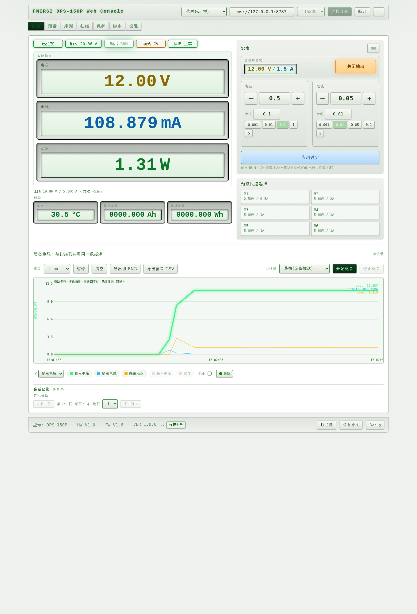
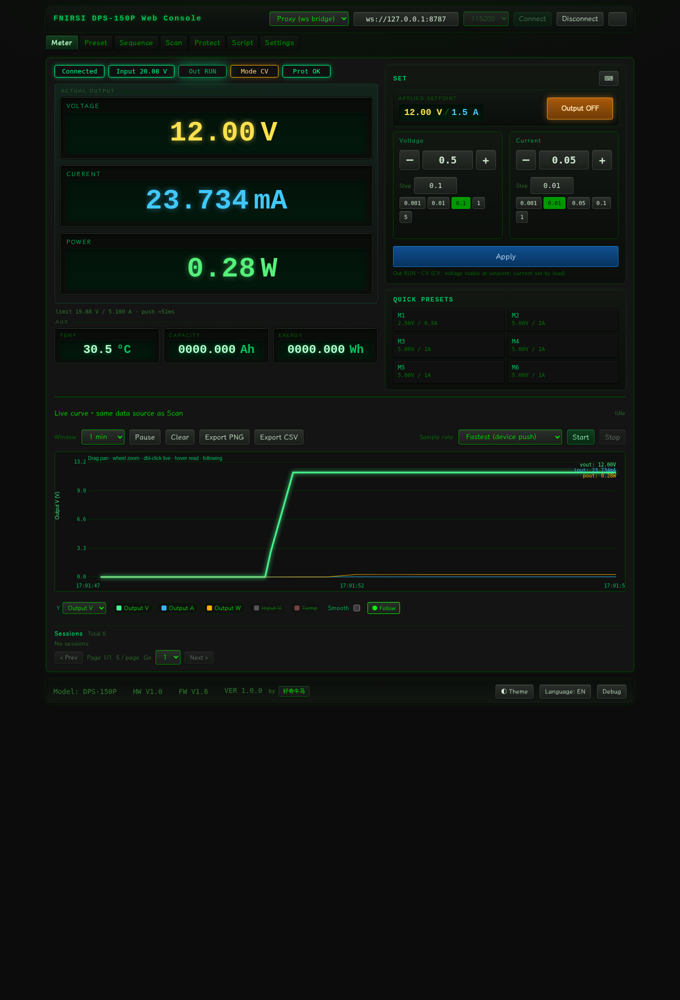
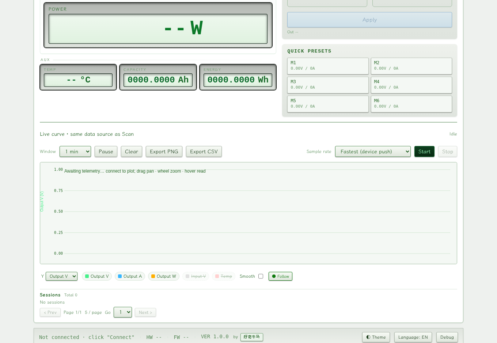
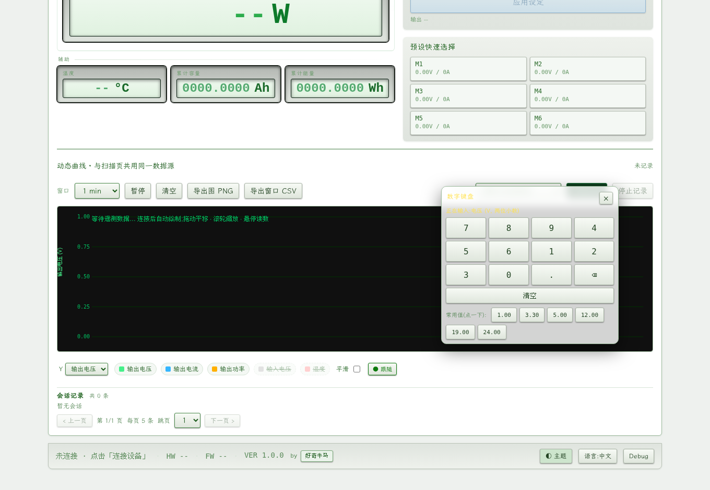
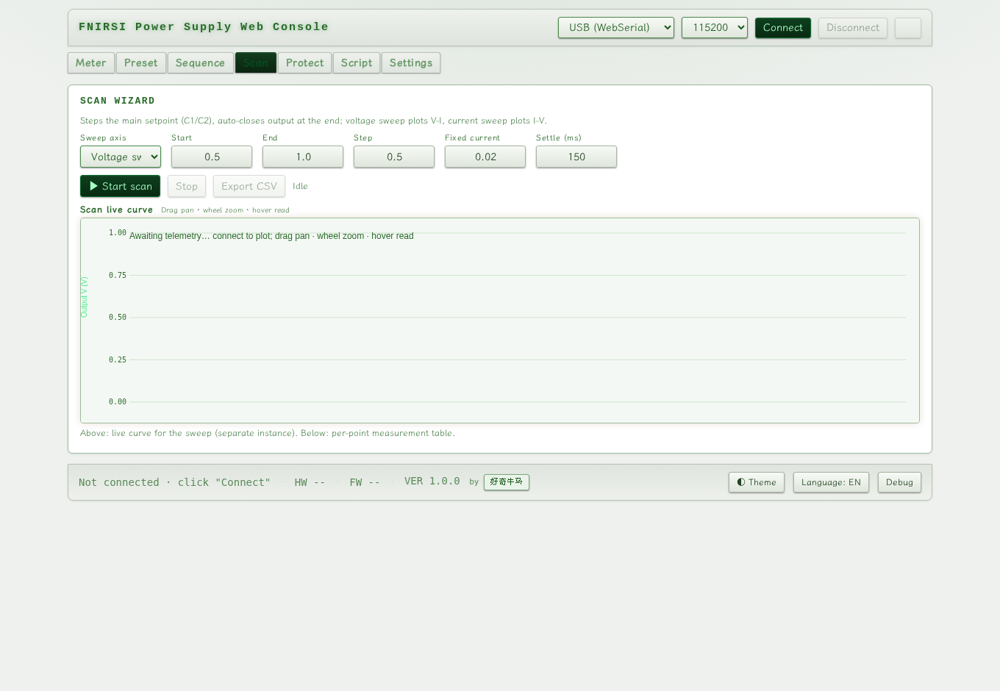
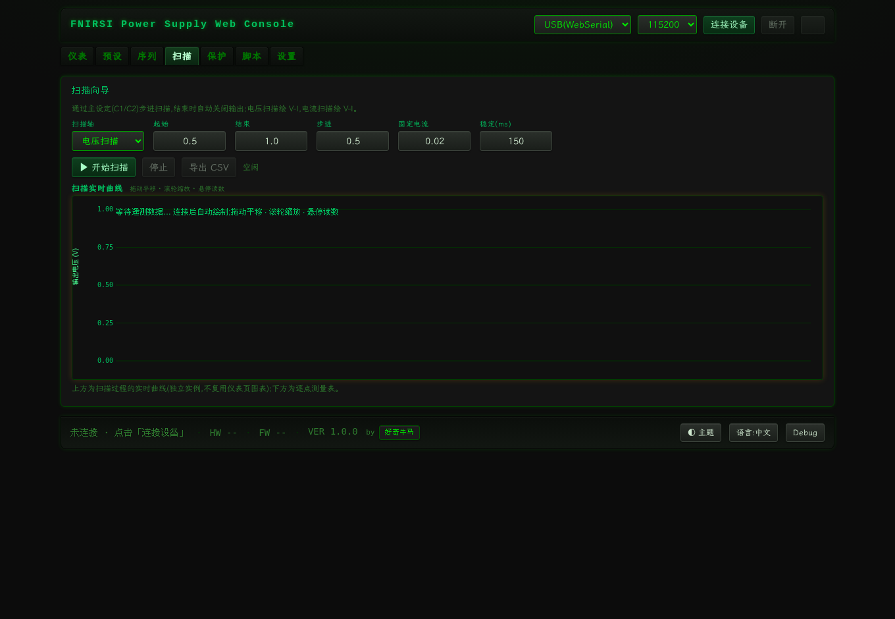

# DPS-150 Web Console - Automated Test Report

> Generated: 2026-09-04T08:46:58.484Z

## Overview

| Total suites | Passed | Failed | Pass rate |
|---|---|---|---|
| 11 | 11 | 0 | 100% |

> ✅ All suites passed.

## Details

| Result | Suite | Exit code | Time | Summary |
|---|---|---|---|---|
| ✅ | TypeScript typecheck | 0 | 4153ms | - |
| ✅ | Unit tests (vitest) | 0 | 4439ms | 72 passed |
| ✅ | Production build | 0 | 4018ms | - |
| ✅ | i18n audit (static) | 0 | 55ms | {"hardcodedCjk":4,"missingTKeys":0} |
| ✅ | preview | 0 | 5231ms | - |
| ✅ | headless smoke | 0 | 3015ms | - |
| ✅ | headless UI/i18n audit | 0 | 5300ms | - |
| ✅ | device-layer full self-test | 0 | 36392ms | 25/25 passed |
| ✅ | device full UI (proxy) | 0 | 34631ms | 22/22 passed |
| ✅ | device edge cases | 0 | 20213ms | 10/10 passed |
| ✅ | screenshots (zh & en) | 0 | 15091ms | - |

## Screenshots











## i18n Static Audit

Scanned by `tools/i18n-audit.mjs` and written to `docs/i18n-audit.json`. The count of hardcoded Chinese (non-UI labels, mostly log/editor-example body text) and missing t() keys are in that file; this run's summary: {"hardcodedCjk":4,"missingTKeys":0}

## How to Run

```bash
make test-suite
# or
node tools/run-suite.mjs
```
